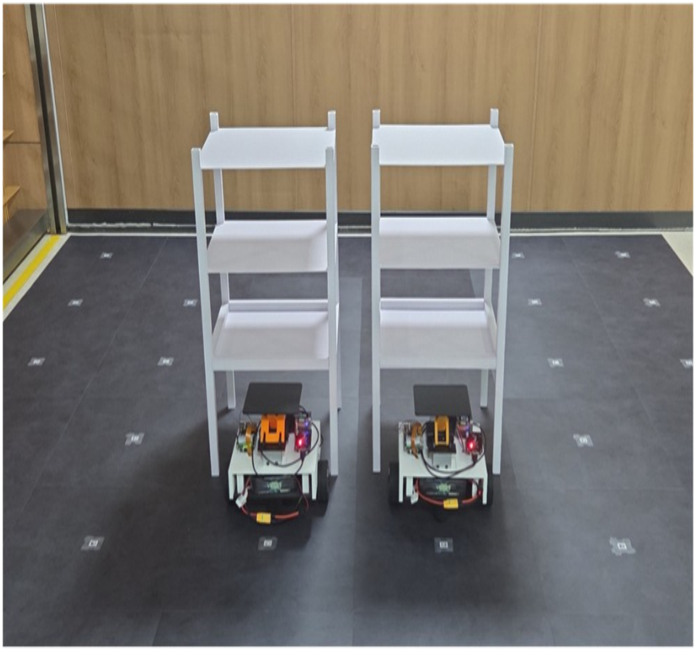
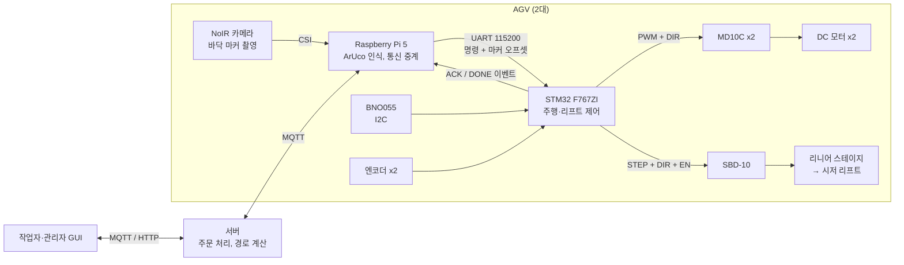
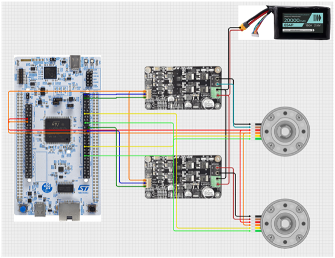
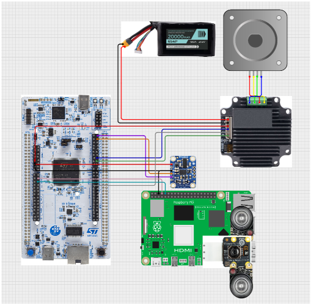
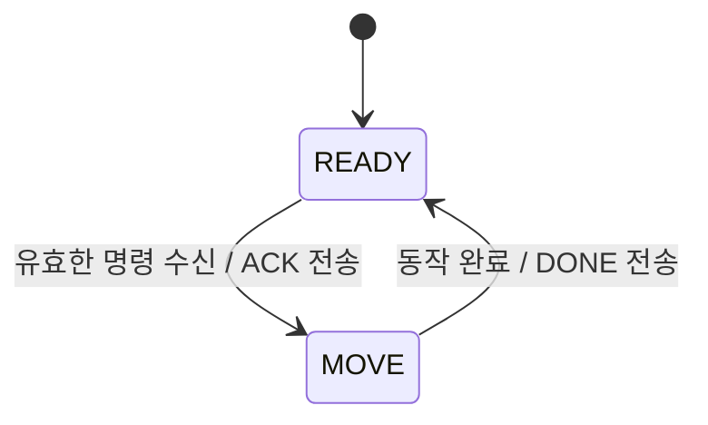
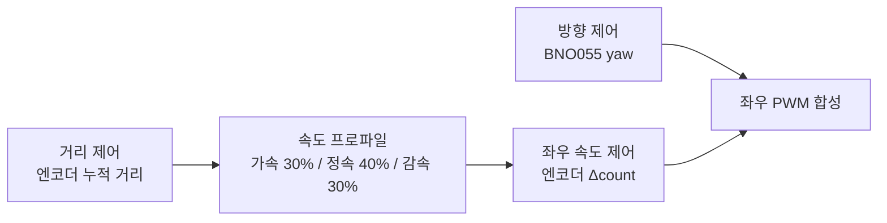
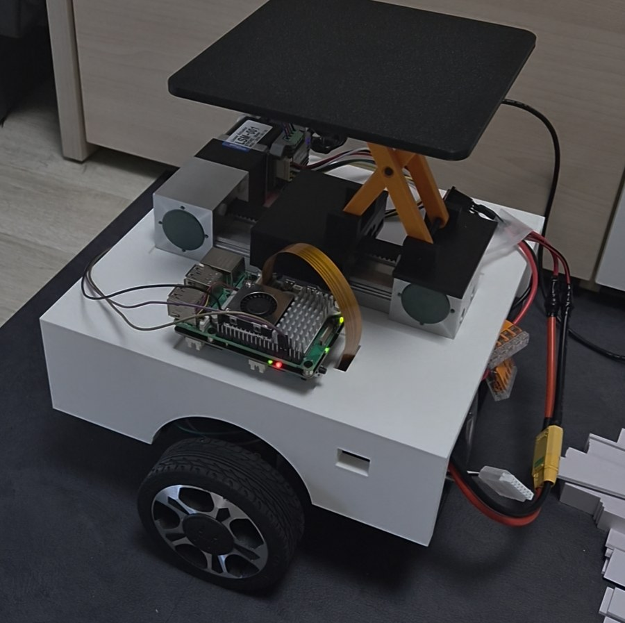
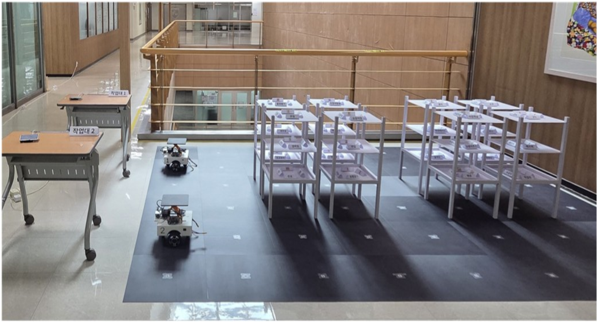

# AGV 기반 물류 시스템

> 이동식 선반 아래로 들어가 시저 리프트로 선반을 들어 올리고, 바닥의 ArUco 마커를 따라 작업대까지 운반하는 AGV 기반 물류 시스템

| 항목 | 내용 |
| --- | --- |
<p align="center"></p>

| 기간 | 2026.03.01 ~ 2026.09.21 |
| 인원 | 4명 (졸업작품) |
| 담당 | 임베디드 펌웨어 및 소프트웨어 개발 |
| MCU | STM32 Nucleo-F767ZI (HAL, STM32CubeIDE) |
| 비전 | Raspberry Pi 5 (Ubuntu), Pi Camera, OpenCV |

## 시연 영상

<!-- [영상 1] 주행 영상: 여기에 첨부 (마커 사이 직진, 회전, 선반 운반이 보이는 10~30초) -->

- [졸업작품 시연 영상](https://youtu.be/i-aV4zTlFss): 주문 수령, 마커 인식 정밀 주행, 리프트, 교착 회피, 디지털 트윈 동기화까지 전체 시연
- [한이음 ICT 멘토링 작품 설명 영상](https://youtu.be/z5R86A-JcSo)

## 프로젝트 배경

물류 현장은 무거운 물건을 반복해서 옮기는 작업이 많아 인력 확보가 어렵습니다. 이 프로젝트는 작업자가 선반까지 걸어가는 대신, AGV가 선반을 통째로 들어 작업대까지 가져다주는 방식(Goods-to-Person)으로 반복 운반 작업을 자동화하는 것을 목표로 했습니다.

전체 시스템은 AGV 2대, 주문과 경로를 관리하는 서버, 작업자·관리자 GUI로 구성되며, 저는 그중 AGV의 임베디드 펌웨어(주행 제어, 리프트 제어)와 마커 인식, 라즈베리파이와 STM32 사이의 통신을 담당했습니다.

## 팀 구성과 역할

| 이름 | 역할 |
| --- | --- |
| 조승현 | 하드웨어 설계 |
| 진선명 | GUI 개발 |
| 이원종 | 시스템 통합, 디지털 트윈 구현 |
| **백주원 (본인)** | **임베디드 펌웨어 및 소프트웨어 개발** |

### 내가 맡은 부분

- STM32에서 엔코더 DC 모터와 BNO055를 이용한 주행 제어 (속도, 거리, 방향 PID)
- 스텝모터 기반 리프트 제어 (타이머 마스터/슬레이브 구성)
- Raspberry Pi 5에서 OpenCV로 ArUco 마커 인식 및 위치·각도 추정
- Raspberry Pi 5와 STM32 간 UART 통신 프로토콜 설계 및 구현
- 회로 제작 및 배선, 전원부 구성 (STM32, Raspberry Pi 5, 모터 전원 분리)

## 시스템 구성



> 서버, GUI, 경로 계산, 디지털 트윈은 팀원이 담당했습니다. 이 레포는 AGV 펌웨어와 마커 인식 부분을 다룹니다.

### 하드웨어

| 구분 | 부품 |
| --- | --- |
| MCU | STM32 Nucleo-F767ZI (SYSCLK 96 MHz) |
| 구동 모터 | Pololu 70:1 Metal Gearmotor 37Dx70L mm 24V, 64 CPR 엔코더 (#4694) x2, 바퀴 지름 100 mm |
| 모터 드라이버 | Cytron MD10C (10 A, 5~30 V, PWM + DIR 입력) x2 |
| IMU | Adafruit BNO055 9-DOF 브레이크아웃 (I2C, IMU 모드로 사용) |
| 리프트 | 시저 리프트를 리니어 스테이지로 구동. 42각 2상 스텝모터 + 일체형 드라이버 SBD-10 (STEP, DIR, EN 입력), 타이밍벨트 리니어 스테이지 LSM-001 (스트로크 50 mm) |
| 비전 | Raspberry Pi 5 + 5MP 적외선 조명 NoIR 카메라 모듈 (차체 아래 바닥 방향 장착, 어두운 차체 아래에서도 마커 인식) |
| 모터 전원 | 22.2 V 3300 mAh 6S 리튬폴리머 배터리 (DC 모터 드라이버, 스텝 드라이버) |
| STM32 전원 | 18650 2셀 배터리 홀더 충전·전원 모듈 (3.3 V, 5 V 출력, PN-HLCH-18650-2S) |
| Raspberry Pi 5 전원 | Suptronics X1200 18650 UPS 모듈 (5 V 5 A) |
| GND | 전원은 세 계통으로 분리하고, 모든 장치의 GND를 STM32 GND 기준으로 공통 연결 |

### 배선도

| 구동부 (DC 모터, 엔코더) | 리프트, IMU, 라즈베리파이 |
| --- | --- |
|  |  |

> 배선도는 6월 기준입니다. 이후 좌우 엔코더 배선을 서로 바꿨으므로, 실제 연결은 아래 핀 배치 표를 기준으로 합니다.

### 핀 배치

| 핀 | 기능 | 연결 |
| --- | --- | --- |
| PC6 | TIM8_CH1 | 왼쪽 모터 PWM |
| PB15 | GPIO 출력 | 왼쪽 모터 DIR |
| PE9 | TIM1_CH1 | 오른쪽 모터 PWM |
| PF13 | GPIO 출력 | 오른쪽 모터 DIR |
| PB4, PB5 | TIM3_CH1, CH2 | 왼쪽 엔코더 A, B |
| PB6, PD13 | TIM4_CH1, CH2 | 오른쪽 엔코더 A, B |
| PA0 | TIM2_CH1 | 리프트 스텝 펄스 (STEP) |
| PD14 | GPIO 출력 | 리프트 방향 (DIR) |
| PD15 | GPIO 출력 | 리프트 드라이버 활성화 (EN) |
| PB8, PB9 | I2C1 SCL, SDA | BNO055 |
| PD5, PD6 | USART2 TX, RX | Raspberry Pi 5 |
| PD8, PD9 | USART3 TX, RX | 디버그 출력 (ST-LINK 가상 COM 포트) |

## 펌웨어 구조

### 사용한 주변장치

| 주변장치 | 용도 | 설정 |
| --- | --- | --- |
| TIM1, TIM8 | 좌우 DC 모터 PWM | 20 kHz |
| TIM3, TIM4 | 왼쪽, 오른쪽 엔코더 | 엔코더 모드 (x4) |
| TIM6 | 제어 주기 인터럽트 | 100 Hz (10 ms) |
| TIM2 | 스텝모터 STEP 펄스 (마스터) | 500 Hz |
| TIM5 | 스텝 수 카운트 (슬레이브) | 외부 클럭 모드 1, 1050스텝마다 인터럽트 |
| USART2 + DMA | Raspberry Pi 통신 | 115200 bps, ReceiveToIdle DMA (DMA1 Stream5, 순환 모드) |
| USART3 | 디버그 로그 (printf) | 115200 bps |
| I2C1 | BNO055 | |
| Flash (Sector 11) | BNO055 캘리브레이션 값 저장 | 부팅 시 로드 |

AGV 2대는 같은 부품과 같은 펌웨어 구조를 쓰지만, 로봇1은 기존 모터를 재활용하고 로봇2는 새 모터를 써서 속도 특성이 달랐기 때문에 기본 PWM, 목표 속도, 회전 PID 게인, 좌측 모터 보정값만 로봇별로 다르게 튜닝했습니다 (`firmware/robot1/main.c`, `firmware/robot2/main.c`).

RTOS 없이 슈퍼루프 + 상태 머신 구조이며, TIM6 인터럽트가 10 ms마다 제어 플래그를 세우면 메인 루프에서 제어 연산을 수행합니다.

명령 코드와 이벤트 규격은 경로 계획을 담당한 서버 팀원과 함께 정했고, 펌웨어는 이 규격대로 명령을 받아 동작합니다.

### 상태 머신



| 명령 | 코드 | 동작 |
| --- | --- | --- |
| FORWARD | 0x01 | 목표 방향으로 제자리 정렬 후 다음 마커까지 직진 |
| STOP | 0x02 | 정지 |
| LIFT_UP / LIFT_DOWN | 0x03 / 0x04 | 리프트 상승 / 하강 |
| ROTATE_LEFT / RIGHT | 0x05 / 0x06 | 제자리 90° 회전 |
| ROTATE_180 | 0x07 | 제자리 180° 회전 |

### 주행 제어

직진은 세 개의 제어기가 함께 동작합니다.



- **속도 제어**: 좌우 바퀴의 10 ms당 엔코더 변화량을 목표 속도에 맞춥니다.
- **거리 제어**: 엔코더 누적값을 거리(mm)로 환산하고, 구간별로 가속·정속·감속하는 속도 프로파일을 만듭니다.
- **방향 제어**: BNO055 yaw와 목표 각도의 차이를 PID로 보정해 좌우 PWM에 반대 부호로 더합니다. 각도 오차는 ±180°로 래핑해 0°/360° 경계에서 튀지 않게 했습니다.
- **회전**: 남은 각도가 10°, 5° 이내로 줄면 기본 PWM을 단계적으로 낮추고, 오차 1° 이내가 10회(100 ms) 연속 유지되면 완료로 판단합니다.

### 마커 기반 보정

AGV는 바닥의 ArUco 마커 사이를 이동하며, 각 마커 위에서 카메라로 현재 위치와 각도를 다시 측정해 누적 오차를 보정합니다.

- **목표 거리**: 기본 507 mm. 선반을 들었을 때 무게 때문에 덜 가는 만큼을 실험으로 맞춰 마커 간격보다 늘린 값
- **횡방향 위치 보정**: 마커 중심에서 좌우로 5 mm 이상 벗어나 있으면, 다음 마커를 향하는 보정 각도를 `atan2`로 계산하고(최대 ±5°) 이동 거리도 다시 계산합니다.
- **yaw 기준 재설정**: 마커로 측정한 각도와 목표 각도 차이가 0.5° 이내이면 BNO055 yaw 기준을 마커 각도로 다시 맞춥니다.
- **엔코더 기준 재설정**: 새 명령을 시작할 때 엔코더 이전값과 누적 거리를 초기화합니다.

### 리프트 제어

<p align="center"></p>

스텝모터가 타이밍벨트 리니어 스테이지(LSM-001)를 움직이고, 스테이지가 시저 리프트를 밀어 상판을 들어 올리는 구조입니다. 차체에 올리기 전에 리프트만 따로 만들어 높이, 속도, 힘을 맞춘 뒤 장착했습니다.
<!-- [영상 2] 리프트 상승·하강 영상: 여기에 첨부 (5~10초) -->

TIM2가 STEP 펄스를 출력하고, TIM5를 **외부 클럭 모드 1의 슬레이브**로 연결해 TIM2의 펄스 수를 하드웨어로 셉니다. 1050스텝에 도달하면 TIM5 인터럽트에서 PWM을 멈추므로, CPU가 펄스를 하나하나 세지 않아도 정확한 스텝 수만큼 리프트가 움직입니다.

## 비전과 통신 (Raspberry Pi 5)

### ArUco 마커 인식

- 카메라를 차체 아래에 바닥 방향으로 달아서 그늘지고 어두운 환경이라, 적외선 조명이 달린 NoIR 카메라를 사용해 조명 조건과 상관없이 마커를 인식
- Picamera2로 프레임을 받아 OpenCV ArUco(`DICT_4X4_250`, 15 mm 마커)로 검출
- 캘리브레이션 데이터로 왜곡 보정 후 `solvePnP`로 마커의 x, y 위치(mm)와 yaw 각도 추정
- 왜곡 보정 맵을 시작할 때 한 번만 만들고 `remap`을 사용해 프레임마다 다시 계산하지 않도록 최적화
- 명령 입력을 별도 스레드와 큐로 분리해 비전 루프가 입력 대기로 멈추지 않도록 구성 (레포의 스크립트는 터미널로 명령을 넣는 테스트 버전이며, 최종 시스템에서는 서버 명령을 MQTT로 받아 STM32로 전달)

### UART 프로토콜

**Raspberry Pi → STM32** (21바이트 고정 길이 ASCII 프레임, 값은 ×10 고정소수점)

```
<명령,±xxxx,±yyyy,±yyyy>
예) <1,+0012,-0035,+0901>  → FORWARD, x=1.2 mm, y=-3.5 mm, yaw=90.1°
```

**STM32 → Raspberry Pi** (1바이트 이벤트)

| 이벤트 | 값 | 의미 |
| --- | --- | --- |
| EVT_ACK | 0xFF | 명령 수신 확인 |
| EVT_DONE | 0x81 | 동작 완료, 다음 명령 대기 |

이벤트는 별도 확인 응답이 없어서, 서버 측에서 이벤트가 유실된다는 피드백을 받아 같은 이벤트를 10 ms 간격으로 3회 전송하도록 했습니다. 근본 원인을 찾기보다는 통합 일정에 맞춘 임시 대응이었고, 개선 방향은 아래 "향후 개선"에 정리했습니다.

### 수신 신뢰성 처리

- `HAL_UARTEx_ReceiveToIdle_DMA`로 프레임을 받고, 길이(21바이트)와 시작·끝 문자(`<`, `>`)를 검사해 깨진 프레임은 버리고 즉시 재수신
- UART 오류(오버런, 노이즈, 프레이밍) 발생 시 플래그를 지우고 DMA 수신을 다시 시작
- 마커 오프셋이 카메라가 볼 수 없는 범위(±30 mm 초과)거나 각도 차이가 10° 이상이면 통신 오류로 보고 보정을 건너뜀

## 결과

- 마커 도착 위치 오차 ±15 mm 이내: AGV가 선반 밑으로 들어가 들어 올리는 구조라, 이 범위를 넘으면 선반 밑으로 진입하지 못함. 팀에서 정한 이 허용 오차를 목표로 주행 제어를 개선
- 마커 간 직진 시 방향 오차 ±0.5° 이내
- 제자리 회전 후 각도 오차 ±1° 이내 (오차 1° 이내가 100 ms 유지되면 완료로 판단)
- AGV 2대 운용 시 5분 동안 작업자 주문 약 2건 처리
- 최종 시연 테스트 통과

### 테스트 환경

<p align="center"></p>

바닥에 ArUco 마커를 격자로 배치하고, 선반 8개와 작업대 2개를 두어 AGV 2대가 주문에 따라 선반을 작업대로 운반하는 환경에서 테스트했습니다.

### 외란 후 복귀 테스트

개발 중 테스트에서, 주행 중 AGV를 들어서 다른 곳에 옮겼다가 원래 마커 위에 다시 올려놓아도 마커에서 위치와 각도를 다시 읽어 다음 동작을 정상적으로 이어가는 것을 확인했습니다. (별도 영상 기록은 없음)

이것이 가능한 이유는 각 구간을 시작할 때마다 이전 주행 기록에 의존하지 않고, 현재 마커에서 측정한 값으로 목표를 새로 계산하기 때문입니다.

- 마커 기준 횡방향 오프셋으로 보정 각도와 이동 거리를 다시 계산
- 명령 시작 시 엔코더 기준값과 누적 거리 초기화
- 마커 각도와 일치하면 IMU yaw 기준을 마커 기준으로 재설정

**한계**: 다시 올려놓을 때 방향이 크게 틀어지면(마커 기준 10° 이상) 통신 오류와 구분하기 위해 보정을 건너뛰도록 설계되어 있어, 원래 방향과 비슷하게 올려놓아야 합니다.

## 협업

펌웨어를 맡으면서 서버와 하드웨어 담당 팀원 사이에서 양쪽의 요구를 펌웨어로 연결했습니다.

- **서버 담당 팀원과**: 경로 계획 결과를 로봇에 전달하는 명령 코드표와 ACK/DONE 이벤트 규격을 함께 정하고, 펌웨어가 이 규격대로 명령을 받아 동작하도록 구현했습니다. 통합 테스트 중 이벤트 유실 문제가 보고되어 송신 방식도 조정했습니다.
- **하드웨어 담당 팀원과**: AGV가 선반 밑으로 들어가 들어 올리는 구조라, 선반 설계에서 나온 위치 오차 ±15 mm를 펌웨어 정밀도 목표로 받아 주행 제어를 개선했습니다 (아래 2번).
- **리프트 튜닝**: 높이와 속도를 바로 바꿔볼 수 있는 임시 테스트 코드를 만들어, 하드웨어 팀원과 실물을 같이 보면서 "더 높게, 더 천천히, 더 힘 있게" 같은 요청을 그 자리에서 반영했습니다. 힘이 부족할 때는 스텝 속도를 낮추고(스텝모터는 느릴수록 토크가 커짐) 드라이버 설명서를 보며 전류 설정을 올린 뒤 무게 테스트로 확인했습니다. 최종 리프트 설정(1050스텝, 500 Hz)은 이렇게 함께 맞춘 값입니다.

## 트러블슈팅

### 1. 직진 중 갑자기 틀어지는 문제: 가설을 바꿔가며 원인 찾기

- **문제**: 직진 중 갑자기 방향을 틀거나, 회전 시 목표보다 더 또는 덜 회전함
- **첫 번째 가설, 통신 오류**: 마커 데이터가 UART에서 깨진다고 보고 값의 범위 검사를 추가 → 증상 그대로
- **두 번째 가설, 센서 글리치**: 로그에서 yaw가 순간적으로 튀는 것을 확인하고, 10 ms 안에 10° 이상 변하는 값은 직전 정상값으로 대체하는 필터를 추가 → 빈도는 줄었지만 결국 틀어짐
- **실제 원인**: BNO055를 지자기 센서까지 쓰는 퓨전 모드로 사용해서, 모터와 주변 금속의 자기장 영향으로 방향값이 갑자기 보정되고 있었음
- **해결**: 지자기를 쓰지 않는 IMU 모드(가속도 + 자이로)로 전환하고, 캘리브레이션 값을 플래시에 저장해 부팅 때마다 적용. 앞의 두 대응은 통신·센서 순간 오류에 대비한 방어 코드로 유지
- **배운 점**: 증상을 줄이는 대응과 원인을 없애는 해결은 다르다는 것

### 2. 위치 오차 ±15 mm 맞추기

선반 밑으로 진입하려면 마커 도착 위치가 ±15 mm 안에 들어와야 했습니다. 처음에는 구간을 지날수록 오차가 쌓여 이 기준을 넘었고, 원인을 하나씩 찾아 개선했습니다.

| 원인 | 해결 |
| --- | --- |
| 출발하면서 방향을 보정하니 경로가 휘어, 구간마다 좌우 오차가 누적됨 | 제자리에서 방향을 먼저 맞추고(`AGV_ALIGN`) 직진하도록 두 단계로 분리 |
| 정렬 시 0°에 딱 맞추려다 좌우로 떨리는 헌팅 발생 | 1° 허용 범위를 두고 100 ms 유지되면 완료. 남은 작은 오차는 직진 중 방향 PID가 보정 |
| 이전 구간의 PID 적분값과 이전 오차가 남아 새 직진 시작 때 엉뚱하게 보정 | 정렬이 끝나는 시점에 PID와 엔코더 누적값을 모두 초기화 |
| 오래 주행하면 자이로 오차가 쌓여 방향이 틀어짐 | 마커 위에서 측정한 각도와 0.5° 안으로 맞으면 IMU yaw 기준을 마커 기준으로 재설정 |
| 회전이 격해 차체 진동이 심함 | PWM 듀티 상한 45%, 목표 각도 근처에서 기본 PWM을 단계적으로 감속 |

- **결과**: 마커 도착 위치 ±15 mm, 직진 방향 오차 ±0.5°, 회전 후 ±1° 이내로 최종 테스트 통과
- **배운 점**: 여러 오차를 한 번에 보정하기보다 단계를 나눠 하나씩 맞추고, 목표값에 딱 맞추기보다 허용 범위를 두는 것이 안정적이라는 것

### 3. 전원과 GND: 통신이 먹통이 되는 문제

- **문제**: Raspberry Pi와 STM32 사이 UART에서 프레이밍·노이즈 오류가 반복되고, 때때로 통신이 아예 멈춤
- **원인 1, GND 미연결**: 두 보드가 서로 다른 전원(멀티탭 충전기, 노트북 USB)에서 전원을 받아 GND가 공통이 아니었음. 노트북 충전기를 같은 멀티탭에 꽂자 통신이 정상화된 것을 단서로 찾음
- **원인 2, 전원 부족**: Raspberry Pi 5는 전압이 조금만 떨어져도 불안정해지고, 모터는 출발·회전 때 순간 전류로 전압을 흔듦
- **해결**: STM32(18650 전원 모듈), Raspberry Pi 5(5 V 5 A UPS 모듈), 모터(22.2 V 리튬폴리머)로 전원을 분리하고, 모든 장치의 GND는 STM32 기준으로 공통 연결
- **배운 점**: 통신 오류는 소프트웨어보다 전원과 GND 같은 전기적 원인부터 확인해야 한다는 것

## 소스 코드

```
├── firmware/
│   ├── AGV_Control.ioc        CubeMX 설정 (핀, 클럭, 타이머)
│   ├── Core/Inc/              pid.h, rpi_uart.h, BNO055_STM32.h
│   ├── Core/Src/              pid.c, rpi_uart.c, BNO055.c
│   ├── robot1/main.c          로봇1 메인 (재활용 모터에 맞춘 튜닝값)
│   └── robot2/main.c          로봇2 메인
├── calibration/main.c         BNO055 캘리브레이션 전용 펌웨어
├── vision/                    라즈베리파이 ArUco 마커 인식
└── images/
```

두 로봇의 `main.c`는 구조가 같고 튜닝값만 다릅니다. CubeIDE 프로젝트의 `Core/Src/main.c`를 빌드할 로봇의 파일로 교체해서 사용합니다.

| 파일 | 내용 | 작성 |
| --- | --- | --- |
| `robot1/main.c`, `robot2/main.c` | 상태 머신, 주행·리프트 제어, UART 수신 처리 | 직접 작성 (주변장치 초기화는 CubeMX 생성) |
| `Core/Src/pid.c` | 범용 PID 제어기 (조건부 적분 anti-windup) | 직접 작성 |
| `Core/Src/rpi_uart.c` | 라즈베리파이 프레임 파싱, 이벤트 송신 | 직접 작성 |
| `Core/Src/BNO055.c` | BNO055 I2C 드라이버 | 오픈소스 [Afebia/BNO055-STM32-V2](https://github.com/Afebia/BNO055-STM32-V2) (MIT License) 사용, 분석하며 주석 추가 |
| `calibration/main.c` | BNO055 캘리브레이션 후 오프셋을 플래시에 저장 | 직접 작성 |
| `vision/opencv_aruco_marker_detection.py` | 마커 인식, UART 송수신 | 직접 작성 |

### BNO055 캘리브레이션 절차

1. `calibration/main.c`를 올리고 센서를 8자로 돌려 캘리브레이션 (NDOF 모드에서 모든 상태가 3이 될 때까지)
2. 완료되면 오프셋 22바이트를 플래시 Sector 11(`0x081C0000`)에 저장하고 다시 읽어 확인
3. 메인 펌웨어를 올리면 부팅할 때마다 이 값을 읽어 적용. 메인 펌웨어를 다시 올려도 Sector 11은 지워지지 않아 값이 유지됨

### PID 제어기 (`pid.c`)

하나의 구조체로 속도, 거리, 직진 방향, 회전 방향 제어기 5개를 모두 처리하도록 범용으로 작성했습니다.

- **조건부 적분 anti-windup**: 출력이 이미 상한(하한)에 걸려 있고 오차가 같은 방향이면 적분을 멈춰, 포화 상태에서 적분값이 계속 쌓여 오버슈트가 커지는 것을 막습니다.
- **출력 제한**: 계산된 출력을 최대·최소값으로 클램프합니다.
- **상태 초기화**: 새 동작을 시작할 때 `PID_Reset()`으로 이전 동작의 적분값과 이전 오차를 지워, 동작 전환 시 출력이 튀지 않게 했습니다.

| 제어기 | Kp | Ki | Kd | 제어 대상 |
| --- | --- | --- | --- | --- |
| MOTOR_L / MOTOR_R | 1.0 | 0 | 0 | 좌우 바퀴 속도 (10 ms당 엔코더 카운트) |
| DISTANCE | 1.0 | 0 | 0 | 누적 이동 거리 (mm) |
| FORWARD_YAW | 30.0 | 0.005 | 0.055 | 직진 중 방향 오차 (deg) |
| ROTATE_YAW | 5.0 | 0.0001 | 0.1 | 회전 각도 오차 (deg) |

## 향후 개선

- UART 프레임에 체크섬 추가: 현재는 길이와 시작·끝 문자만 검사해 값 자체가 깨진 경우를 범위 검사로만 거르고 있음
- 이벤트 송신 방식 개선: 3회 반복 송신 중 `HAL_Delay`로 약 20 ms 동안 제어 루프가 멈추므로, 비동기 송신이나 시퀀스 번호 기반 확인 응답으로 변경
- RTOS 도입으로 통신과 제어 태스크 분리
- 로봇별 튜닝값을 설정 파일로 분리해 하나의 코드로 두 로봇을 빌드
- 동작 중(MOVE)에 들어온 명령을 거부하고 BUSY 응답을 보내, 서버의 송신 타이밍이 어긋나도 펌웨어가 스스로 막도록 개선
